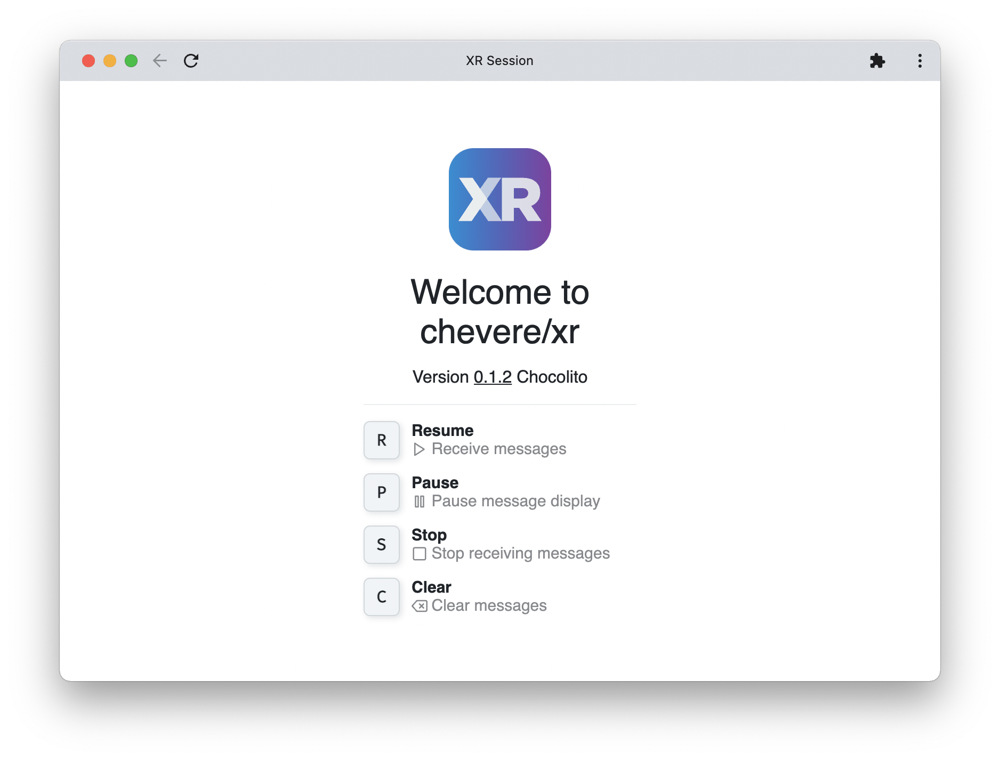
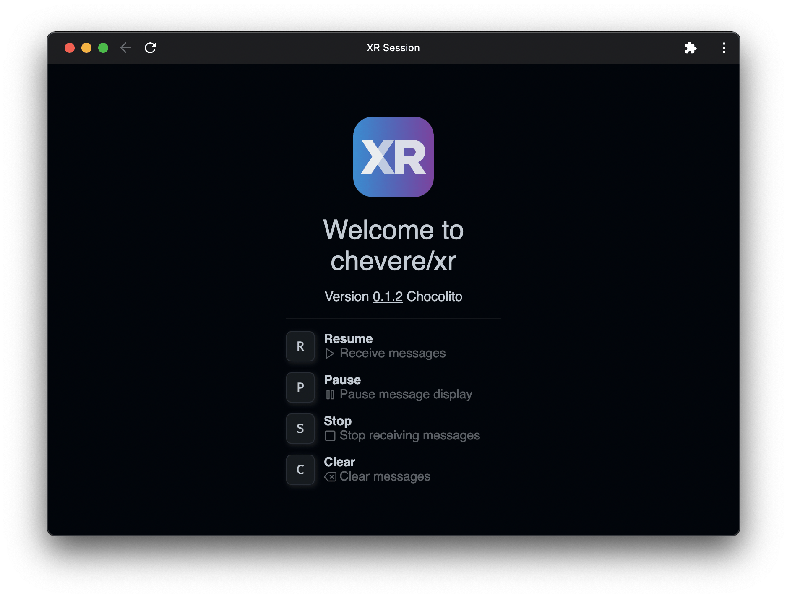
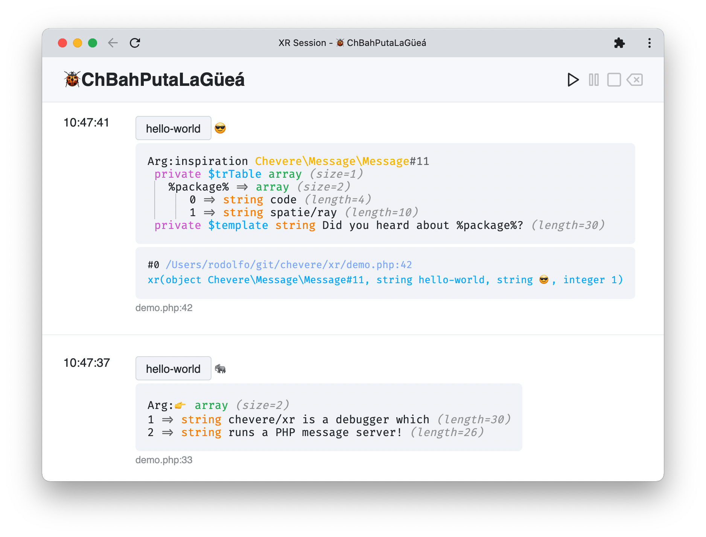
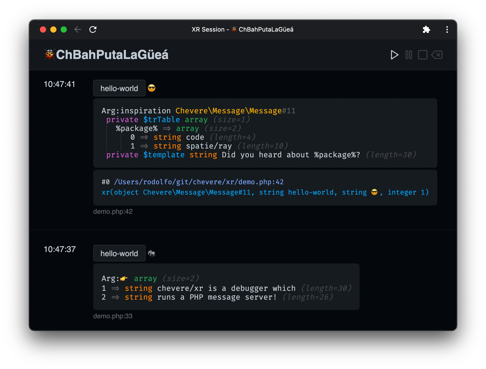

# XR

> 🔔 Subscribe to the [newsletter](https://newsletter.chevereto.com/subscription?f=gTmksA6763vPCG763763kYCOTgWu6Kx4BPohVDY97aHddrqis6B763cHay8dhtmMKlI6r3vUfGREZmSvDNNGj3MlrRJV7A) to don't miss any update regarding Chevere.

<p align="center"></p>

https://user-images.githubusercontent.com/20590102/151376274-56fae8c6-ac08-4d32-8488-9c1d699c0cdb.mp4

🦄 [View demo](https://user-images.githubusercontent.com/20590102/151376274-56fae8c6-ac08-4d32-8488-9c1d699c0cdb.mp4)

 [](LICENSE)

[](https://sonarcloud.io/dashboard?id=chevere_xr) [](https://sonarcloud.io/dashboard?id=chevere_xr) [](https://sonarcloud.io/dashboard?id=chevere_xr) [](https://sonarcloud.io/dashboard?id=chevere_xr) [](https://sonarcloud.io/dashboard?id=chevere_xr) [](https://sonarcloud.io/dashboard?id=chevere_xr) [](https://www.codefactor.io/repository/github/chevere/xr) [](https://www.codacy.com/gh/chevere/xr/dashboard)

XR is a dump debug server utility for PHP. No extras required, debug your PHP code anywhere.

<p align="center">
    
    
</p>

## Features

* 💎 Colorful, typed, easy-on-the eye dump variable highlight
* ✨ Dump n arguments
* 🐘 One-click PHP server run (no extras required)
* 👻 Filter messages by [Topics](#topic) and [Emotes](#emote)
* ✍️ Re-name "XR Session" to anything you want
* 🏁 Resume, Pause, Stop and Clear debug window controls
* 🥷 Keyboard shortcuts for ninjas (Resume **R**, Pause **P**, Stop **S** and Clear **C**)
* 😊 Export message to clipboard (plain text) or as inline-download PNG image
* 📟 Generates dump [backtrace](#flags)
* ⏸ [Pause](#flags) and resume your code execution (*not implemented)
* 🌚 Dark / 🌝 Light mode follows your system preferences
* 👽 Ephemeral, it doesn't store any persistent data
* 🍒 HTML based (save page, search, shortcuts, etc.)
* 🔥 Uses [FiraCode](https://github.com/tonsky/FiraCode) font for displaying _beautiful looking dumps_ ™
* 😅 Handle exceptions (hook or replace your existing handler)

<p align="center">
    
    
</p>

## Contributing

Feel free to contribute on [issues](https://github.com/chevere/xr/issues) and [discussions](https://github.com/chevere/xr/discussions) with your thoughts in how to improve XR.

## Getting started

* Add `chevere/xr` as a dev dependency in your project:

```sh
composer require --dev chevere/xr
```

`🚧 Min stability dev`

You will require to add this to your `composer.json` file.

```json
    "minimum-stability": "dev",
    "prefer-stable": true
```

## Start the server

```sh
php vendor/chevere/xr/server.php -p 27420
```

The server will be available at [http://localhost:27420](http://localhost:27420)

## Demo

Open the debugger and then run:

```php
php vendor/chevere/xr/demo.php
```

## XR Helpers

### Dump variables

Use `xr($var1, $var2,...)` to dump *any variable* from your code.

```php
xr($var, 'Hola, mundo!');
```

### Topic

Add a topic passing `t:`.

```php
xr(
    $var,
    'Hola, mundo!',
    t: 'Epic win'
);
```

### Emote

Add an emote passing `e:`.

```php
xr(
    $var,
    'Hola, mundo!',
    t: 'Epic win',
    e: '😎'
);
```

### Flags

Pass bitwise flags to trigger special behavior.

* `f: XR_BACKTRACE` to dump debug backtrace.

```php
xr(
    $var,
    'Hola, mundo!',
    t: 'Epic win',
    e: '😎',
    f: XR_BACKTRACE
);
```

* `f: XR_PAUSE` to pause code execution (*not implemented).

```php
xr(
    $var,
    'Hola, mundo!',
    t: 'Epic win',
    e: '😎',
    f: XR_PAUSE
);
```

### Send raw message

Use `xrr` to send a raw message to the server.

💡 `xrr` also supports [topic](#topic) `t`, [emote](#emote) `e` and [flags](#flags) `f` arguments.

```php
xrr(
    '<h1>Hola, mundo!</h1>',
    t: 'Greet'
);
```

### Exception handling

Use `registerThrowableHandler` to enable XR to handle throwables.

```php

use Chevere\Xr\registerThrowableHandler;

// True append XR's to your existing handler
// False use only XR's handler
registerThrowableHandler(true);
```

Alternatively, you can use `throwableHandler` in any existing exception handler logic:

```php
use Chevere\Xr\throwableHandler;

set_exception_handler(
    function(Throwable $throwable) {
        // ...
        try {
            throwableHandler($throwable);
        } catch(Throwable) {
            // Don't panic
        }
    }
);
```

### Error handling

You will require to handle errors as exceptions and from there use [Exception handling](#exception-handling).

```php
use use Chevere\ThrowableHandler\ThrowableHandler;

set_error_handler(
    ThrowableHandler::ERRORS_AS_EXCEPTIONS
);
register_shutdown_function(
    ThrowableHandler::FATAL_ERROR_HANDLER
);
```

## Configuration

Optionally configure XR by creating a file named `xr.php` in your project directory with the following options:

* `enable`
  * `bool` Controls sending messages to the server. Set true to enable, false to disable.
* `host`
  * `string` The hostname/IP address where XR server is running.
* `port`
  * `int` Port to connect to the `host`.

The following example is a `xr.php` file with default settings.

```php
<?php

return [
    'enable' => true,
    'host' => 'localhost',
    'port' => 27420,
];
```

## Docker

See [DOCKER](./DOCKER.md).

## Message reference

The XR dump server can receive messages from *anywhere*:

```plain
POST http://localhost:27420/message
    body=Hola, mundo
    file_path=/var/www/file.php
    file_line=123
    ...
```

* `body` - The message raw body (HTML).
* `file_path` - The file path.
* `file_line` - The file line.
* `emote` - emote (emojis/symbols)
* `topic` - Topic as message context.

## License

Copyright 2022 [Rodolfo Berrios A.](https://rodolfoberrios.com/)

XR is licensed under the Apache License, Version 2.0. See [LICENSE](LICENSE) for the full license text.

Unless required by applicable law or agreed to in writing, software distributed under the License is distributed on an "AS IS" BASIS, WITHOUT WARRANTIES OR CONDITIONS OF ANY KIND, either express or implied. See the License for the specific language governing permissions and limitations under the License.
