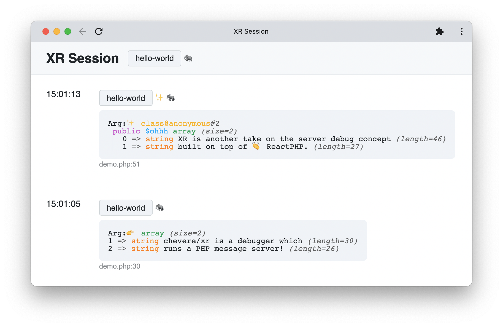
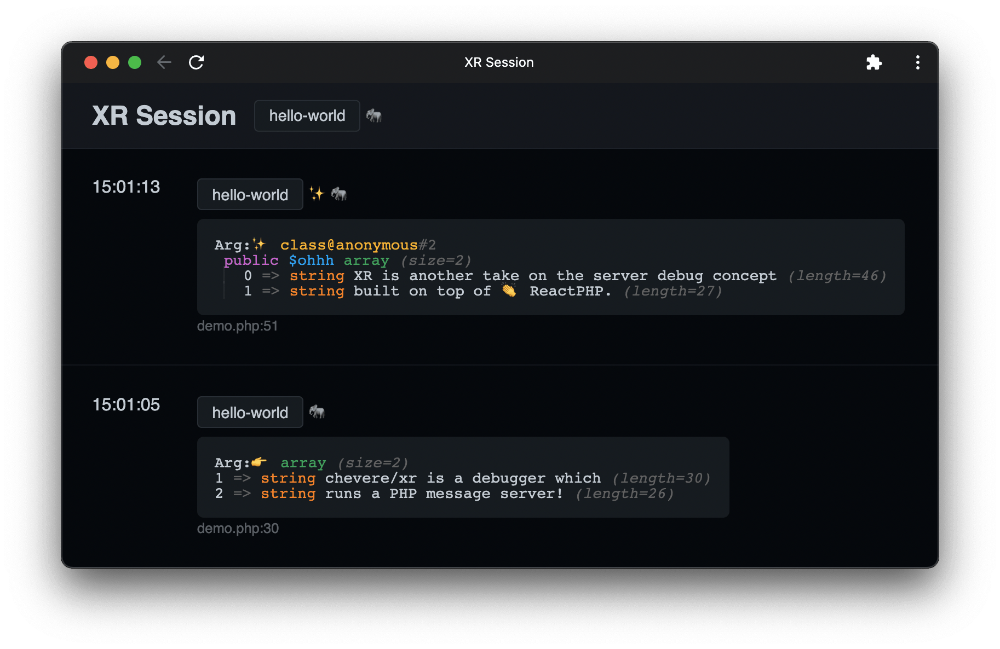

# XR

> 🔔 Subscribe to the [newsletter](https://newsletter.chevereto.com/subscription?f=gTmksA6763vPCG763763kYCOTgWu6Kx4BPohVDY97aHddrqis6B763cHay8dhtmMKlI6r3vUfGREZmSvDNNGj3MlrRJV7A) to don't miss any update regarding Chevere.

<p align="center"></p>

https://user-images.githubusercontent.com/20590102/148118746-56588764-bfd7-44af-a51d-f94cd6d7caec.mp4

🦄 [View demo](https://user-images.githubusercontent.com/20590102/148118746-56588764-bfd7-44af-a51d-f94cd6d7caec.mp4)

 [](LICENSE)

[](https://sonarcloud.io/dashboard?id=chevere_xr) [](https://sonarcloud.io/dashboard?id=chevere_xr) [](https://sonarcloud.io/dashboard?id=chevere_xr) [](https://sonarcloud.io/dashboard?id=chevere_xr) [](https://sonarcloud.io/dashboard?id=chevere_xr) [](https://sonarcloud.io/dashboard?id=chevere_xr) [](https://www.codefactor.io/repository/github/chevere/xr) [](https://www.codacy.com/gh/chevere/xr/dashboard) [](https://codeclimate.com/github/chevere/xr/maintainability)

XR is a dump server utility built on top of ReactPHP.

<p align="center"></p>

## Features

* ✨ Dump single or multiple arguments
* 😊 One-click server run on top of PHP (no extras required)
* 👻 Filter messages by [Topics](#topic) and/or [Emotes](#emote)
* 📟 Dump backtrace (if you need it)
* ⏸ Pause your code execution (*not implemented yet)
* 🌚 Dark / 🌝 Light mode follows your system preferences
* 👽 Ephemeral as it doesn't require to store any persistent data
* 🍒 It's HTML based, save your session for offline usage

<p align="center">
    
</p>

## Getting started

* Add `chevere/xr` as a dev dependency in your project:

```sh
composer require --dev chevere/xr
```

`🚧 Min stability dev`

You will require to add this to your `composer.json` file.

```json
    "minimum-stability": "dev",
    "prefer-stable": true
```

## Start the server

* With PHP:

```sh
php vendor/chevere/xr/server.php -p 27420
```

* With Docker:

```sh
docker run -d -p 27420:27420 --name chevere-xr ghcr.io/chevere/xr
```

The server will be available at [http://localhost:27420](http://localhost:27420)

## Demo

Open the debugger and then run:

* With PHP:

```php
php demo.php
```

* With Docker:

```php
docker exec -it chevere-xr \
    php demo.php
```

## XR Helpers

### Dump variables

Use `xr($var1, $var2,...)` to dump any *variable* from your code.

```php
xr($var, 'Hola, mundo!');
```

### Topic

Add a topic passing `t:`.

```php
xr($var, 'Hola, mundo!', t: 'Epic win');
```

### Emote

Add an emote passing `e:`.

```php
xr($var, 'Hola, mundo!', t: 'Epic win', e: '😎');
```

### Flags

Pass bitwise flags to trigger special behavior.

* `f: XR_BACKTRACE` to dump debug backtrace.

```php
xr($var, 'Hola, mundo!', t: 'Epic win', e: '😎', f: XR_BACKTRACE);
```

* `f: XR_PAUSE` to pause code execution (*not implemented).

```php
xr($var, 'Hola, mundo!', t: 'Epic win', e: '😎', f: XR_PAUSE);
```

## Configuration

You can optionally configure XR by creating a file named `xr.php` in your project directory.

* `enable`: `bool` Controls sending messages to the server. Set true to enable, false to disable.
* `host`: `string` The hostname/IP address where XR server is running.
* `port`: `int` Port to connect to the `host`.

The following example is a `xr.php` file with default settings.

```php
<?php

return [
    'enable' => true,
    'host' => 'localhost',
    'port' => 27420,
];
```

### Docker configuration

When using Docker, the host should point to the internal IP of your Docker host by using `host.docker.internal`.

```php
<?php

return [
    // ...
    'host' => 'host.docker.internal',
];
```

## Docker

### Start/Stop

```sh
docker container start chevere-xr
```

```sh
docker container stop chevere-xr
```

### Remove

```sh
docker container rm chevere-xr -f
```

### Build

```sh
docker build -t ghcr.io/chevere/xr:tag .
```

## Message reference

The server can receive messages from *anywhere*:

```plain
POST http://localhost:27420/message
    body=Hola, mundo
    file_path=/var/www/file.php
    file_line=123
    ...
```

* `body` - The message raw body (HTML).
* `file_path` - The file path.
* `file_line` - The file line.
* `emote` - emote (emojis/symbols)
* `topic` - Topic as message context.
