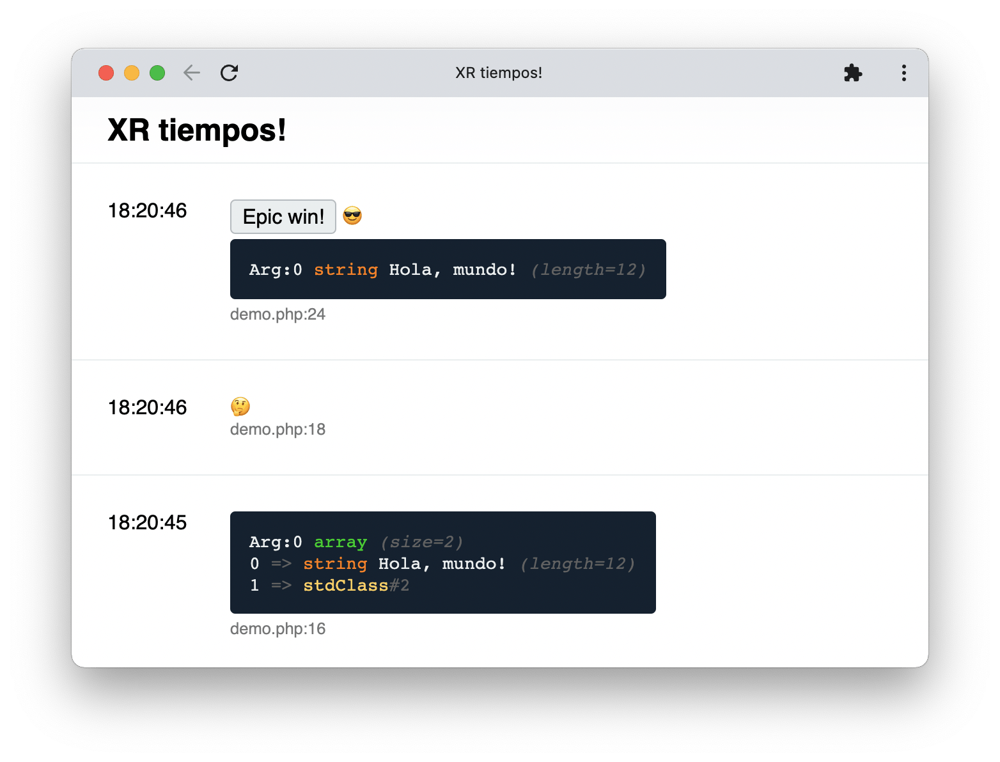

# XR

> 🔔 Subscribe to the [newsletter](https://newsletter.chevereto.com/subscription?f=gTmksA6763vPCG763763kYCOTgWu6Kx4BPohVDY97aHddrqis6B763cHay8dhtmMKlI6r3vUfGREZmSvDNNGj3MlrRJV7A) to don't miss any update regarding Chevere.

<p align="center">
    
    
</p>

 [](LICENSE)

Chevere Remote (XR) dump debugging utility built on top of ReactPHP.

## Status

This project is under preview status.

## Getting started

* Clone this repository
* Install the dependencies using Composer

```sh
composer install
```

## Start the dump server

If you added this package as a dependency:

```sh
php vendor/chevere/xr/server.php 9666
```

If you cloned this repository:

```sh
php server.php 9666
```

The server will be available at [http://localhost:9666](http://localhost:9666)

## Demo

Open the debugger and then run:

```php
php demo.php
```

## Sending messages

* POST parameters
  * `body` - The message raw body (HTML).
  * `file_path` - The file path.
  * `file_line` - The file line.
  * `file_display` - The file + line.
  * `file_display_short` - The file basename + line.
  * `flair` - Flair (emojis/symbols)
  * `topic` - Topic as message context.

```plain
POST http://localhost:9666/message
    body=Hola, mundo
    file_path=/var/www/file.php
    file_line=123
    ...
```

## XR Helpers

`🚧 Min stability dev`

* Add `chevere/xr` as a dev dependency in your project:

```sh
composer require --dev chevere/xr
```

### Dump variables

Use `xr($var1, $var2,...)` to dump any *variable* from your code.

```php
xr($var, 'Hola, mundo!');
```

### Topic

Add a topic `t:` for message context.

```php
xr($var, 'Hola, mundo!', t: 'Epic win');
```

### Flair

Add flairs `f:` for message tags.

```php
xr($var, 'Hola, mundo!', t: 'Epic win', f: '😎');
```

### Action

`🚧 Not implemented`

Pass an action `a:` to trigger special events:

| Action `a:` | Effect          | Example            |
| ----------- | --------------- | ------------------ |
| `pause`     | Pause execution | `xr(a: XR_PAUSE);` |
