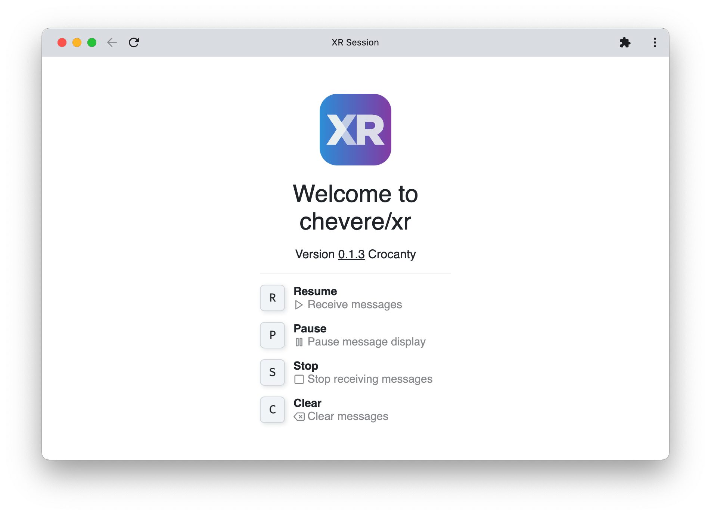
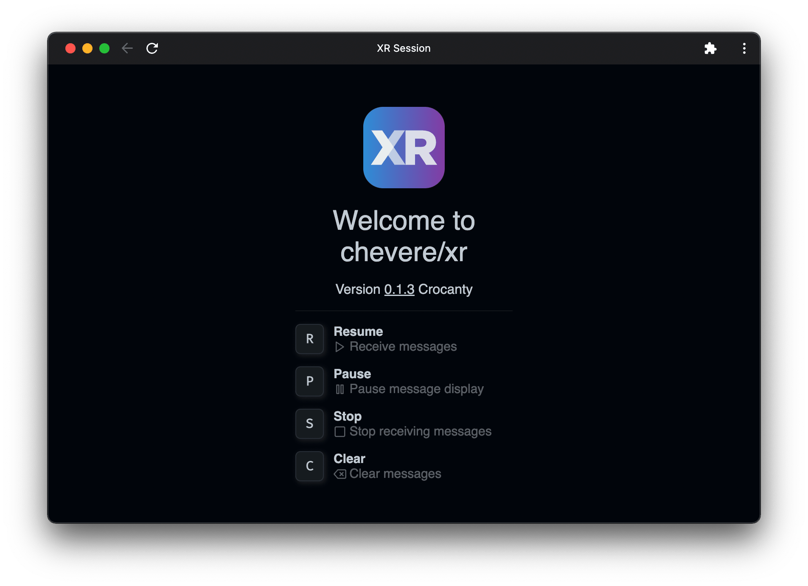
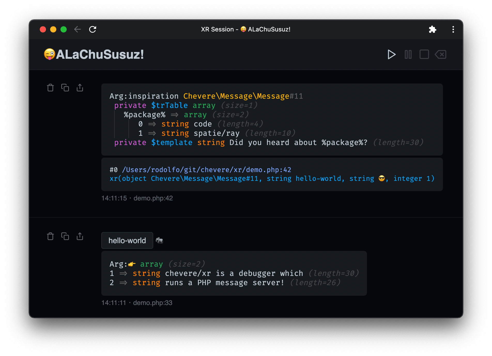

# xrDebug

> 🔔 Subscribe to the [newsletter](https://chv.to/chevere-newsletter) to don't miss any update regarding Chevere.

<p align="center"></p>

https://user-images.githubusercontent.com/20590102/153045551-619c74cc-c4ae-41da-b7b6-bd8733e623a2.mp4

🦄 [View demo](https://user-images.githubusercontent.com/20590102/153045551-619c74cc-c4ae-41da-b7b6-bd8733e623a2.mp4)

[](https://github.com/chevere/xr/actions)

[](LICENSE)
[](https://phpstan.org/)

[](https://sonarcloud.io/dashboard?id=chevere_xr)
[](https://sonarcloud.io/dashboard?id=chevere_xr)
[](https://sonarcloud.io/dashboard?id=chevere_xr)
[](https://sonarcloud.io/dashboard?id=chevere_xr)
[](https://sonarcloud.io/dashboard?id=chevere_xr)
[](https://sonarcloud.io/dashboard?id=chevere_xr)
[](https://www.codefactor.io/repository/github/chevere/xr)
[](https://www.codacy.com/gh/chevere/xr/dashboard)

[xrDebug](https://xr-docs.chevere.org/) is a dump debug utility for PHP. No extras required, **debug** your PHP code **anywhere**. It uses a ReactPHP SSE server to provide a web-based debug application.

## Quick start

* Install using [Composer](https://getcomposer.org/)

```sh
composer require --dev chevere/xr
```

* Run the xrDebug [server](https://xr-docs.chevere.org/server/)

```sh
docker run -t --init --rm -p 27420:27420 ghcr.io/chevere/xr-server
```

<p align="center">
    
    
</p>

## Documentation

👉 [xr-docs.chevere.org](https://xr-docs.chevere.org)

## Features

* Signed requests (Ed25519)
* End-to-end encryption (AES-GCM AE)
* Dump arguments using [VarDump](https://chevere.org/packages/var-dump.html)
* One-click disposable debug PHP server (no extras required)
* Filter messages by [Topics](https://xr-docs.chevere.org/helpers/xr.html#topic) and [Emotes](https://xr-docs.chevere.org/helpers/xr.html#emote)
* Resume, Pause, Stop and Clear debug window controls
* Keyboard shortcuts (Resume **R**, Pause **P**, Stop **S** and Clear **C**)
* Re-name "xrDebug" session to anything you want
* Export dump output to clipboard or as PNG image
* Generates dump [backtrace](https://xr-docs.chevere.org/helpers/xr.html#flags)
* [Pause](https://xr-docs.chevere.org/helpers/xri.html#pause) and resume your code execution
* Dark / 🌝 Light mode follows your system preferences
* Ephemeral, it doesn't store any persistent data
* Portable & HTML based (save page, search, etc.)
* Uses [FiraCode](https://github.com/tonsky/FiraCode) font for displaying _beautiful looking dumps_ ™
* Handle exceptions (hook or replace your existing handler)
* Open with editor links

<p align="center">
    
</p>

## License

Copyright 2023 [Rodolfo Berrios A.](https://rodolfoberrios.com/)

xrDebug is licensed under the Apache License, Version 2.0. See [LICENSE](LICENSE) for the full license text.

Unless required by applicable law or agreed to in writing, software distributed under the License is distributed on an "AS IS" BASIS, WITHOUT WARRANTIES OR CONDITIONS OF ANY KIND, either express or implied. See the License for the specific language governing permissions and limitations under the License.
